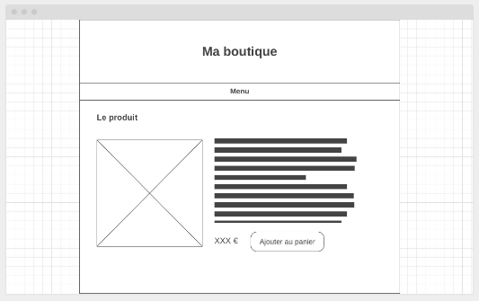
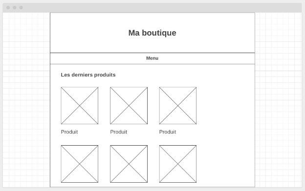
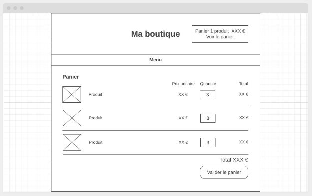
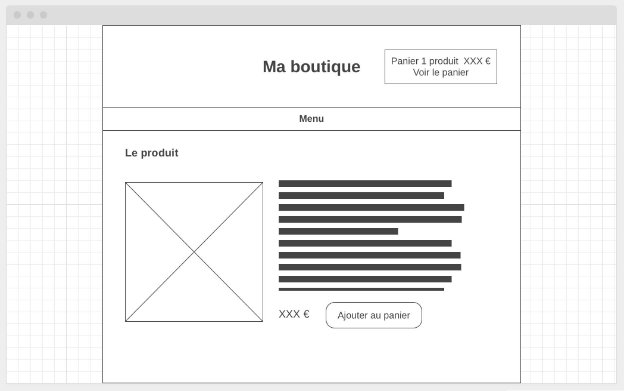
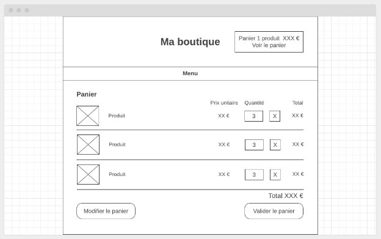
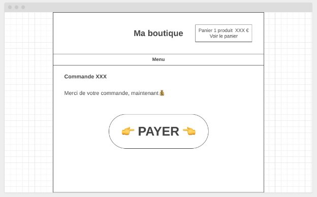

**DEVOPS** 21 - Boutique PHP 

**2025** KIT APPRENANT

OBJECTIFS

Objectif Pédagogique

Utiliser les structures de contrôle de PHP pour gérer des données.

Concevoir, mettre en œuvre et utiliser des fonctions PHP afin de créer, de lire, de modifier et de supprimer les données de l’application dans une base de données.

Démarche pédagogique

Vous allez créer une boutique, le choix du nom, du concept… est libre

La réalisation d’une boutique, va permettre d’utiliser un modèle de données et manipuler des données avec PHP.

Vous allez travailler en îlot, vous faites d'abord l’étape en solo ou en pair-programming puis vous mettez en commun en pratiquant une [revue de code ](https://fr.wikipedia.org/wiki/Revue_de_code)pour améliorer, sélectionner et fusionner le meilleur code.

Vous savez maintenant structurer votre code en différents fichiers (header.php, footer.php, index.php …), maintenant vous savez faire et le formateur vous demande d’être rigoureux.

- La convention de nommage de votre code sera en anglais 󰏅(variables comme fonctions…).
- L’usage d’un front controller est requis.
- Typage de vos arguments et de vos retour de fonction.
- L’usage de fonction : 1 fonction = 1 tâche … 2 tâches = 2 fonctions, essayé de découper en plus de fonctions possibles.
- Pas de redondance de code.
- Séparation des couches (logique, template/HTML, accès à la base de données).
- Vous allez utiliser Git pour chaque étape et travailler en commun sur le même dépôt Git.
- Vous utiliserez un convention pour le nom de vos commits [Commits Conventionnels 1.0.0](https://www.conventionalcommits.org/fr/v1.0.0/)
- A chaque étape un commit tagué avec le numéro de l’étape
- Utiliser régulièrement la fonction debug (fournis en étape 1.3) pour afficher le contenu de vos variables

Compétences **18**

*Itération 1*

- [cc] Choisir le bon type et la bonne taille des données à stocker
- Créer une base de données
- [cc] Utiliser des clefs primaires et étrangères
- Définir les concepts de base/tables/champs/données/relations

*Itération 2*

- PDO : Connexion à la Bdd
- PDO : Exécuter une requête de sélection et traiter le résultat
- [cc] Programmer une boucle

*Itération 3*

- [cc] Programmer une condition
- [cc] Éviter la redondance
- Récupérer les données d’un formulaire en PHP
- [cc] Passer des paramètres à une fonction
- [cc] Programmer une fonction et l'appeler
- [cc] Programmer avec des tableaux
- [cc] Programmer avec des variables

MODALITÉS

Durée

5 jours soit 35 heures au total.

Lancement le 01/02/2024 et clotûre le 07/02/2024.

Formateur(s)

Flacher Romain, référent module Johann Delebarre

TRAME

|||**Planning**|**Jour**|**Sujet**|**Activités**||
| :- | :- | - | - | - | - | :- |
|01/02|PHP BDD|J Delebarre|J Delebarre|1|Stack Technique Consulter le catalogue|Itération 1|
|02/02|PHP BDD|J Delebarre|J Delebarre|2|Consulter le catalogue Gérer son panier|Itération 2|
|05/02|PHP BDD|R Flacher|R Flacher|3|Gérer son panier|Itération 3|
|06/02|PHP BDD|R Flacher|R Flacher|4|Gérer son panier|Itération 3|
|07/02|PHP BDD|R Flacher|R Flacher|5|Gérer son panier|Itération 3|

**ITÉRATION 1** Stack Technique

Modalités

- Travail individuel en autonomie
- ½ jours en présentiel

Livrables

Un dépôt git initialisé contenant la structure du projet.

Objectifs

Lorem ipsum dolor sit amet, consectetur adipiscing elit, sed do eiusmod tempor incididunt ut labore et dolore magna aliqua. Ut enim ad minim veniam, quis nostrud exercitation ullamco laboris nisi ut aliquip ex ea commodo consequat.

Compétences

- [cc] Choisir le bon type et la bonne taille des données à stocker
- Créer une base de données
- [cc] Utiliser des clefs primaires et étrangères
- Définir les concepts de base/tables/champs/données/relations
1. **— Création du vhost 0.1h** — Présentiel

Reprenez ce que vous avez fait le cours précédent pour créer un vhost au nom de boutique.local :

- Dossier “boutique” dans /var/www/boutique/public/
- host : boutique.local
- Placer un fichier index.php dans /var/www/boutique/public/ avec un echo “Bienvenue sur la boutique”
- Testez sur <http://boutique.local> que “Bienvenue sur la boutique” s’affiche.![ref1]
2. **— Création de la BDD 3h** — Présentiel

Vous allez concevoir la base de données pour une boutique avec MySQL Workbench ou Adminer pour faire le MCD. Mais il vous faudra le traduire au format mermaid.

La base de données aura les tables :

- Des produits avec le titre, un descriptif, un prix HT, poids, une tva et un stock
- Des catégories, un produit peut être uniquement dans une catégorie
- Des clients avec nom, prénom, email et mot de passe
- Des commandes avec leur date de commande, date de livraison, le client
- Les commandes contiennent plusieurs ligne avec une quantité qui sont associées aux produits

N'oubliez pas créer **un utilisateur spécial pour cette base de données**, n’ayant les droits que sur cette BDD.

COMPÉTENCES ASSOCIÉES

- [cc] Choisir le bon type et la bonne taille des données à stocker
- Créer une base de données
- [cc] Utiliser des clefs primaires et étrangères
- Générer le modèle de données à l’aide de MySQL workbench
- Définir les concepts de base/tables/champs/données/relations (⚠ il faut expliquer les mots au formateur)

RESSOURCES

- [Entity Relationship Diagrams | Mermaid](https://mermaid.js.org/syntax/entityRelationshipDiagram.html)

**Livrables**

Un commit initial avec :

- Le fichier gitignore configuré pour ignorer les répertoires de configuration des différentes IDE utilisé par l’équipe
- Un répertoire /database/ avec deux fichier sql séparé, un pour créer vos tables et un autre fichier sql pour remplir vos table avec une jeu de données d’exemples.
- Un répertoire /doc/ avec des fichier Markdown contenant :
- Un MCD au format mermaid
- Le concept de votre boutique (ce qu'elle vend, le nom, etc...)![ref1]
3. **— Mise en place du FrontController et de la structure de 1h** — Présentiel **l’application**

   Vous allez mettre en place un structure de dossiers et de fichiers pour organiser votre projet :

votre\_projet/

│

├── bootstrap/ # Amorce de l'application

│ └── app.php #appelle les fichiers nécessaires (connexion à la BDD, session …) │

├── config/

│ └── database.php # Configuration de la BDD

│

├── route/ #les routes de l’application

│ └── web.php #votre FrontController avec les routes HTTP

│

├── public/

│ ├── index.php # Point d'entrée, inclut app.php et web.php

│ ├── img/ # Images du design

│ │ └── product/ # les images des produits

│ ├── css/ # Fichiers CSS

│ └── js/ # Fichiers JavaScript

│

├── app/

│ ├── persistences/ # Gestion de la persistance des données

│ ├── controllers/ # Logique de contrôle des actions

│ └── helpers/ # Fonctions utiles

│

├── resources/

│ └── views/ # Pages HTML avec PHP pour l'affichage

│ ├── layouts/ # Header et Footer

│ ├── errors/ # Gestion des erreurs (ex. 404.php)

│ ├── product/ # Pages des produits

│ └── cart/ # Pages du panier

│

├── database/ # Dump SQL de la base de données

│ ├── boutique\_structure.sql

│ └── boutique\_data.sql

│

└── doc/ # Documentation du projet

Pourquoi tous ses dossiers ? Pour découper en plusieurs parties le code, séparer la logique (controller) de l'affichage (views). En appliquant une structure claire, nous évitons de perdre du temps à chercher du code, des erreurs…

Astuce : utiliser un fichier vide .gitkeep pour conserver sur le repo git les répertoires même si il sont vide.

**Livrables**

- Un commit tagué de l’étape

**ITÉRATION 2**        Consulter le catalogue

Modalités

- Travail individuel en autonomie
- 1 jours en présentiel

Livrables Objectifs Compétences

- PDO : Connexion à la Bdd
- PDO : Exécuter une requête de sélection et traiter le résultat
- [cc] Programmer une boucle
1. **— Afficher un produit** 3.5h — Présentiel

Wireframe de la page produit :

Créer un fichier **/resources/views/product/show.php** qui va afficher le détail d’un produit

- Vos prix sont affichés en TTC, pensez à rajouter la taxe.
- Un formulaire
- Qui envoie, avec la méthode POST, les données vers la future page **/index.php?action=cart**
- Un bouton “Ajouter au panier” qui est un bouton de type submit
- Un champ de type “number” pour changer la quantité

COMPÉTENCES ASSOCIÉES

- PDO : Connexion à la Bdd
- PDO : Exécuter une requête de sélection et traiter le résultat

**Livrables**

Un commit tagué avec :

- La page produit comme le wireframe, L’URI de la page : /index.php?action=product&id=idduproduitenbdd
- La fonction “getProduct” qui retourne un produit de la BDD dans /app/persistences/product.php![ref1]
1. **— Page d’accueil : lister les produits 3.5h** — Présentiel

Vous devez concevoir une page d’accueil de votre site /resources/views/home.php listant les produits de votre boutique venant de votre BDD.

COMPÉTENCES ASSOCIÉES

- [cc] Programmer une boucle

**Livrables**

Un commit tagué de l’étape

- La page d'accueil comme le wireframe, l’URI de la page : /index.php
- La fonction “getAllProducts” qui retourne tous les produits de la BDD dans /app/persistences/product.php![ref1]

**ITÉRATION 3** Gérer son panier

Modalités

- Travail individuel en autonomie
- 3.5 jours en présentiel

Livrables

En tant que client je veux pouvoir gérer mon panier d’achat qui persiste entre mes visites sans m’identifier.

Objectifs

Créer une interface graphique

Faire des logigrammes avant de coder, cf livrable.

Compétences

- [cc] Programmer une condition
- [cc] Éviter la redondance
- Récupérer les données d’un formulaire en PHP
- [cc] Passer des paramètres à une fonction
- [cc] Programmer une fonction et l'appeler
- [cc] Programmer avec des tableaux
- [cc] Programmer avec des variables
1. **—** Afficher le panier **7h** — Présentiel

Créez le fichier /views/cart/index.php qui liste les produits du panier.

Les produits du panier sont stockés en session avec la variable superglobale $\_SESSION.

Le panier sera stocké dans la clef $\_SESSION[‘cart’], le panier ne doit contenir que les quantités et les id des produits, rien de plus. Cela veut dire que votre tableau contenant votre panier, ne doit pas contenir de prix, nom de produit, … juste l’id et la quantité du produit.

Pourquoi ? Si un produit change de nom, de prix ou autre, il ne faut pas que votre panier contient des informations obsolètes, donc ces informations doivent être récupérées à chaque fois dans la BDD pour faire les calculs de totaux du panier.

Pour faire vos essais, vous allez peupler $\_SESSION[‘cart’] avec 3 produits sélectionnés et avec une quantité différente.

RESSOURCES

- [Session & Cookies - Concevez votre site web avec PHP et Md\].d\].ySQL](https://openclassrooms.com/fr/courses/918836-concevez-votre-site-web-avec-php-et-mysql/4239476-session-cookies)
- [Introduction - Manual](https://www.php.net/manual/fr/intro.session.php)

**Livrables**

Un commit tagué de l’étape

- Faire un logigramme avec mermaidjs avant de commencer à coder. Déposez le pseudo-code dans un fichier markdown dans le répertoire /doc
- La page produit comme le wireframe, l’URI de la page : /index.php?action=cart
- Dans /app/persistences/cart.php
- Une fonction “initCart” qui initialise le panier
- Une fonction “fakeCart” qui peuple le panier avec des données de test
- Une fonction “totalCart” qui retourne un array avec le total en € du panier et le nombre de produits pour l’afficher dans le header du site.![ref1]
2. **—** Ajouter un produit au panier **7h** — Présentiel

Sur page produit, le bouton “Ajouter au panier” permet d’ajouter au panier.

COMPÉTENCES ASSOCIÉES

- [cc] Programmer une condition

**Livrables**

Un commit tagué de l’étape

- Compléter et mettre à jour le logigramme fait avec mermaidjs avant de commencer à coder.
- Un fonction “addProductCart” qui permet d’ajouter un produit au panier avec sa quantité dans /app/persistences/cart.php
- La page produit avec le bouton “Ajouter au panier” qui renvoi vers l’URI /index.php?action=cart![ref4]
3. **—** Modifier un produit du panier **7h** — Présentiel

Sur la page /index.php?action=cart en cliquant sur “modifier le panier”, on peut mettre à jour la quantité des produits du panier

⚠ Attention, si le client met une quantité de 0, cela doit supprimer le produit du panier.

COMPÉTENCES ASSOCIÉES

- [cc] Programmer une condition

**Livrables**

Un commit tagué de l’étape

- Compléter et mettre à jour le logigramme fait avec mermaidjs avant de commencer à coder
- Un fonction “updateProductCart” dans /app/persistences/cart.php qui permet de mettre à jour les quantités des produits au panier
- La page /index.php?action=cart avec le bouton “Modifier le panier” qui met à jour les quantité du panier![ref4]
1. **—** Supprimer un produit du panier **3.5h** — Présentiel

En cliquant sur le **X** à droite de la quantité, le produit est supprimé du panier.

COMPÉTENCES ASSOCIÉES

- [cc] Éviter la redondance
- Récupérer les données d’un formulaire en PHP
- [cc] Passer des paramètres à une fonction
- [cc] Programmer une fonction et l'appeler
- [cc] Programmer avec des tableaux
- [cc] Programmer avec des variables

**Livrables**

Un commit tagué de l’étape

- Compléter et mettre à jour le logigramme fait avec mermaidjs avant de commencer à coder
- Un fonction “deleteProductCart” dans /app/persistences/cart.php qui permet de mettre à jour les quantités des produits au panier
- La page /index.php?action=cart avec le bouton “Modifier le panier” qui met à jour les quantité du panier

**ITÉRATION 4**

Bonus 🎁

Modalités

- Travail individuel en autonomie
1. **— Enregistrement de la commande 2h** — Présentiel

En cliquant sur “valider le panier”, le panier va se transformer en commande (stockage dans la BDD). Une vérification des stocks est nécessaire et cela va décrémenter les stocks.

**Livrables**

- Un logigramme fait avant de commencer à coder
- Les fonctions dans **/app/persistences/command.php**
- La page **/index.php?action=command**
- Un commit tagué de l’étape![ref4]
1. **— Accès administrateur 4h** — Présentiel

Vous rajoutez une page avec formulaire (email et mot de passe), si le client est “administrateur”, il pourra supprimer et modifier un produit du catalogue.

**Livrables**

- Une page **/index.php?action=login** (email et mot de passe), vous devrez rajouter un champ “admin” dans la table “customers” qui vaut 1 quand le client est “administrateur”.
- Un fois connecté, nous sommes redirigés vers la page d'accueil.
- Dans la session $\_SESSION[‘admin’] = true qui permet de faire apparaître sur le site des boutons pour supprimer ou modifier un produits dans la BDD.
  - Suppression méthode GET : /index.php?action=deleteProduct&id=XXX
  - Modification méthode POST : /index.php?action=updateProduct&id=XXX
- Un lien déconnexion est présent dans le header du site, cela permet de se déconnecter avec l’URI **/index.php?action=logout**
- Un commit tagué de l’étape![ref4]
21/21

[ref1]: ./doc/img/Aspose.Words.29802801-1581-4e3e-9b37-bcf3780f0717.004.png
[ref2]: ./doc/img/Aspose.Words.29802801-1581-4e3e-9b37-bcf3780f0717.005.png
[ref3]: ./doc/img/Aspose.Words.29802801-1581-4e3e-9b37-bcf3780f0717.013.png
[ref4]: ./doc/img/Aspose.Words.29802801-1581-4e3e-9b37-bcf3780f0717.014.png
