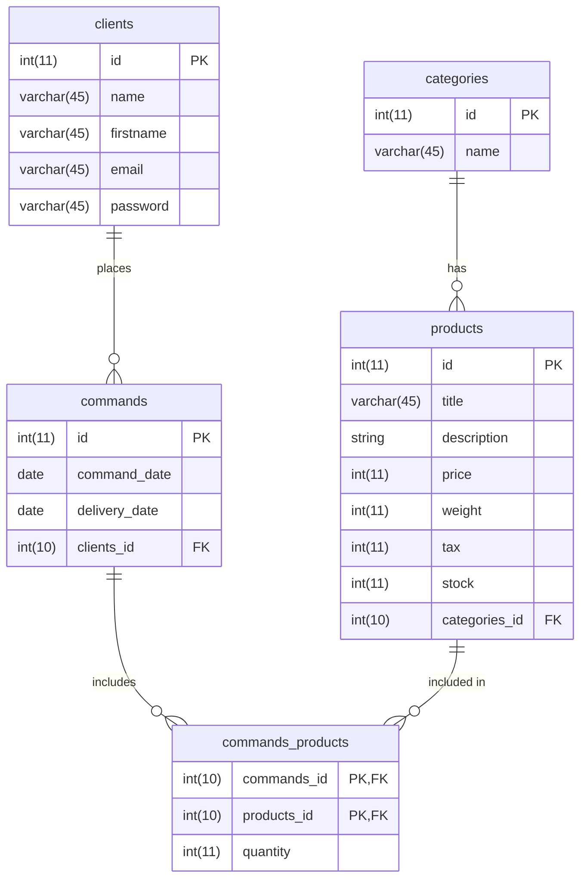

```mermaid
erDiagram
    categories {
        int(11) id PK
        varchar(45) name
    }

    clients {
        int(11) id PK
        varchar(45) name
        varchar(45) firstname
        varchar(45) email
        varchar(45) password
    }

    commands {
        int(11) id PK
        date command_date
        date delivery_date
        int(10) clients_id FK
    }

    commands_products {
        int(10) commands_id PK, FK
        int(10) products_id PK, FK
        int(11) quantity
    }

    products {
        int(11) id PK
        varchar(45) title
        string description
        int(11) price
        int(11) weight
        int(11) tax
        int(11) stock
        int(10) categories_id FK
    }

    categories ||--o{ products: "has"
    clients ||--o{ commands: "places"
    commands ||--o{ commands_products: "includes"
    products ||--o{ commands_products: "included in"
```