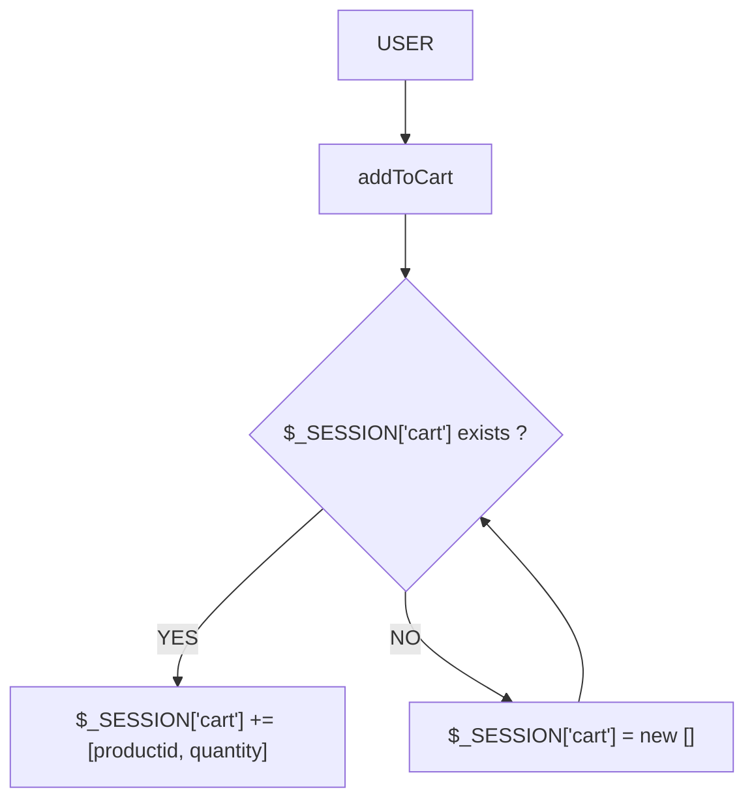
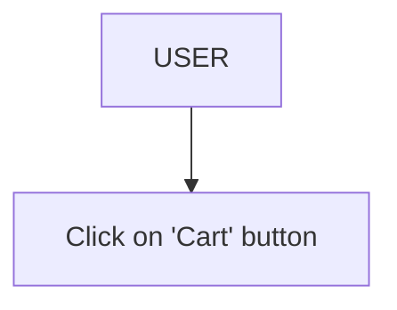

```mermaid
graph TD
   USER --> addToCart 
   addToCart --> S{"$_SESSION['cart'] exists ?"}
   S --YES--> A["$_SESSION['cart'] += [productid, quantity]"]
   S -- NO --> B["$_SESSION['cart'] = new []"]
   B --> S
   
```

```mermaid
graph TD
    U[USER] --> D[Click on 'Cart' button]
```