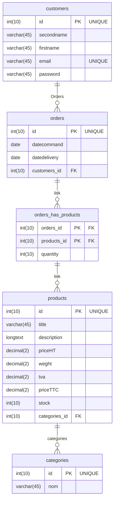

```mermaid

erDiagram
    customers {
        int(10) id PK "UNIQUE"
        varchar(45) secondname
        varchar(45) firstname
        varchar(45) email "UNIQUE"
        varchar(45) password
    }

    orders {
        int(10) id PK "UNIQUE"
        date datecommand
        date datedelivery
        int(10) customers_id FK
    }

    orders_has_products {
        int(10) orders_id PK "FK"
        int(10) products_id PK "FK"
        int(10) quantity 
    }

    products {
        int(10) id PK "UNIQUE"
        varchar(45) title
        longtext description
        decimal(2) priceHT
        decimal(2) weght
        decimal(2) tva
        decimal(2) priceTTC
        int(10) stock
        int(10) categories_id FK
    }

    categories {
        int(10) id PK "UNIQUE"
        varchar(45) nom
    }
    
    customers ||--o{ orders: Orders
    orders ||--o{ orders_has_products: link
    orders_has_products ||--o{ products: link
    products ||--o{ categories: categories
```