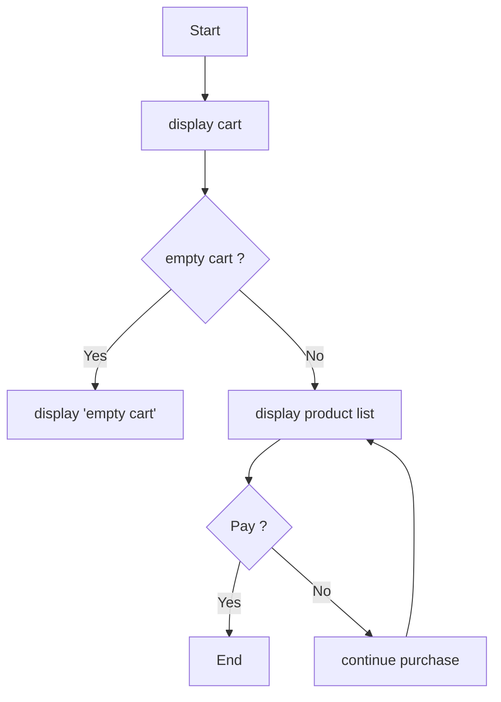

```mermaid
graph TD
A[Start] --> B[display cart]
B --> C{empty cart ?}
C -- Yes --> D[display 'empty cart']
C -- No --> E[display product list]
E --> F{Pay ?}
F -- Yes --> G[End]
F -- No --> H[continue purchase]
H --> E
```